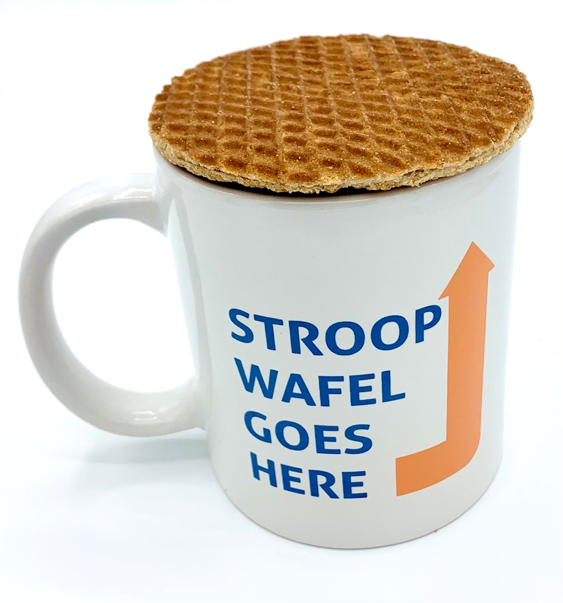

Ik zei laatst dat ik echt van Nederland houd, en toen vroeg een Nederlandse kennis me: *‘Maar wat valt er nou te houden van dit land?’* Dus ja, dat zette me aan het denken. En hier is mijn lijstje met dingen die ik geweldig vind aan Nederland! 🇳🇱

## 1. De meest tevreden mensen in Nederland zijn buschauffeurs. 🚍
O mijn god, ze lijken zo blij met hun werk te zijn, en ik kom altijd uit de bus met een hooggestemdheid.

## 2.	Het land is klein, dus alles is bereikbaar, zelfs met het OV. 🚄
Ja, er zijn twee drukke spoorlijnen: Amsterdam-Zuid - Den Haag en Utrecht Centraal - ’s-Hertogenbosch. Soms is er een storing op het spoor, maar het is fantastisch dat ik van Amsterdam naar Brussel in twee uur kan reizen!

    <iframe width="560" height="315" src="https://www.youtube.com/embed/m_wuFsE1SzU" allow="accelerometer; autoplay; clipboard-write; encrypted-media; gyroscope; picture-in-picture" allowfullscreen></iframe>

## 3.	Het weer is voorspelbaar. ☔
Ik weet hoe het klinkt, maar het is waar: het regent bijna altijd. Als het niet regent, kun je genieten van het goede weer en heb je geen reden om te klagen.

## 4. Het is veilig 364 dagen per jaar.  🛡️
Tijdens Koningsnacht gaat iedereen los, maar op andere dagen kun je je in het land echt veilig voelen. Voor mij is het allerbelangrijkste dat ik ’s nachts alleen naar huis kan komen.
## 5.	Mensen spreken goed Engels. 🇬🇧
Ja hoor, hun Engels is minder goed buiten Amsterdam en nog meer buiten de Randstad, maar in vergelijking met Rusland of Italië spreken mensen hier beter Engels. En ze gedragen zich fatsoenlijk, zonder arrogantie, zelfs als hun Engels slechter is dan dat van jou.
## 6.	Die lieve Nederlandse oma’s en opa’s. 👵👴
Ik kan niet zeggen dat ik doordrongen ben van mijn interacties met jonge Nederlanders, maar elk gesprek met een oudere persoon in het Concertgebouw of op straat vult mijn hart met warmte. De meest beleefde, meest nederige mensen in Nederland zijn ouderen.
## 7.	Bossche bollen en stroopwafels. 🍩
Hands down, ik vind ze zo lekker!

## 8.	Het is overal groen.  🌳
Behalve in drukke wijken in de Randstad is het echt groen in Nederland: velden, parken, tuinen. Het hele land ziet er prachtig uit!
## 9.	Nederlanders zijn direct. 🗨️
Ik merk dat ik nu niet meer twijfel of ik mijn buurman heb beledigd of niet. Hij zou het me meteen zeggen als dat zo was! Het bespaart me veel mentale energie.
## 10.	Je kunt een hypotheek krijgen zonder aanbetaling. 🏡
Met de stijgende prijzen op de woningmarkt is dat echt een voordeel!
## 11. Nederland is vlak, en dat geldt niet alleen voor het landschap. ⚖️
Ik kom uit een land waar de zin *“Buiten de Moskouse ringweg is er geen leven”* de realiteit weerspiegelt. Als je in Rusland iets wilt bereiken in het leven, moet je naar een grote stad verhuizen, liefst Moskou of Sint-Petersburg. Regio’s in Rusland overleven, ze leven niet echt, omdat al het geld in Moskou blijft. 

Hier in Nederland kun je min of meer dezelfde levensstandaard verwachten in Amsterdam als in een klein stadje bij de Duitse grens. (En als je waarde hecht aan een rustig leven, wil je Amsterdam misschien juist verlaten.) 
## 12.	Het culturele leven in Nederland is enorm. 🎭
Klassieke muziek, technofeesten, dans en theater – er zijn zoveel plekken en evenementen die je hier kunt bezoeken! Ik reis soms naar Utrecht, Eindhoven of Heerlen om mijn favoriete bands te zien (ik denk dat ze het zich niet kunnen veroorloven om een zaal in Amsterdam te huren). Ik zou dit elke dag doen als ik genoeg tijd, geld en energie had! Mijn agenda zit elk jaar vol!
## 13.	Geen hiërarchie. 🤝
Toen ik bij een startup werkte, lunchte ik af en toe met de eigenaar. Ik was geschokt toen ik erachter kwam dat hij meer dan twee miljoen per jaar aan onze startup uitgaf. Ik heb nog nooit zoveel geld gezien! Voor hem was het slechts één uitgavenpost, maar hij heeft me nooit het gevoel gegeven dat ik zijn gezelschap niet waard was.
## 14.	Nederlanders zijn meestal punctueel. 🕒
Ik raak erg van slag als evenementen 20-30 minuten te laat beginnen of als mijn vrienden te laat zijn voor een afspraak. Hier kan ik erop rekenen dat alles op tijd begint, tenzij er een noodgeval is.
## 15. De Nederlandse marechaussee is de knapste ter wereld. 
Ik krijg meteen zin om tien keer per maand het land uit te vliegen, alleen maar om ze te bewonderen. (Gelukkig spreekt mijn vriendin bijna geen Nederlands en kan ze dit niet lezen :D)

---

Deze lijst is natuurlijk niet compleet. Ik heb de goede wegen, de indrukwekkende duinen van Texel, de geurige lavendelvelden, de beste museumtentoonstellingen ter wereld, de geweldige excursies en de ongelooflijk getalenteerde mensen niet eens genoemd!
