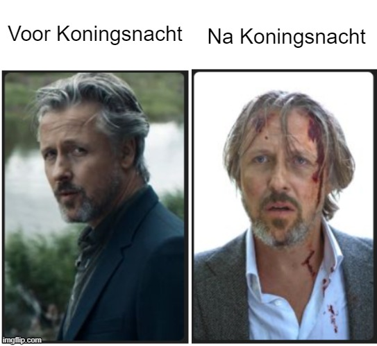

Ik zei laatst dat ik echt van Nederland houd, en toen vroeg een Nederlandse kennis me: *‘Maar wat valt er nou te houden van dit land?’* Dus ja, dat zette me aan het denken. En hier is mijn lijstje met dingen die ik geweldig vind aan Nederland! 🇳🇱

## 1. De meest tevreden mensen in Nederland zijn buschauffeurs. 🚍
Oh mijn god, ze stralen zoveel plezier in hun werk uit dat ik altijd met een glimlach en een opgewekt humeur uit de bus stap.

## 2.	Het land is klein, dus alles is bereikbaar, zelfs met het OV. 🚄
Ja hoor, er zijn twee beruchte spoorlijnen: `Amsterdam-Zuid - Den Haag` en `Utrecht Centraal - ’s-Hertogenbosch`. Het lijkt alsof storingen daar aan de orde van de dag zijn, maar toch blijft het fantastisch dat je in slechts twee uur van Amsterdam naar Brussel kunt reizen!

    <iframe width="560" height="315" src="https://www.youtube.com/embed/m_wuFsE1SzU" allow="accelerometer; autoplay; clipboard-write; encrypted-media; gyroscope; picture-in-picture" allowfullscreen></iframe>

## 3.	Het weer is voorspelbaar. ☔
Ik weet hoe het klinkt, maar het is nu eenmaal zo: de regen is hier een trouwe metgezel. Maar als de zon zich eindelijk laat zien, kun je dubbel genieten van het goede weer en heb je werkelijk geen reden om te klagen

## 4. Het is veilig 364 dagen per jaar.  🛡️
Tijdens Koningsnacht gaat iedereen uit zijn dak, maar op de overige dagen straalt het land een gevoel van veiligheid uit. Voor mij is het grootste cadeau dat ik hier ’s nachts in mijn eentje naar huis kan lopen zonder een greintje angst.

## 5.	Mensen spreken goed Engels. 🇬🇧
Zeker, buiten Amsterdam en vooral buiten de Randstad is hun Engels vaak minder vloeiend. Maar in vergelijking met Rusland of Italië spreken mensen hier nog steeds beter Engels. Bovendien blijven ze beleefd en zonder een greintje arrogantie, zelfs als hun Engels niet zo goed is als dat van jou.
## 6.	Die lieve Nederlandse oma’s en opa’s. 👵👴
Hoewel ik niet kan zeggen dat ik diep onder de indruk ben van mijn interacties met jonge Nederlanders, raakt elk gesprek met een oudere persoon – of het nu in het Concertgebouw is of gewoon op straat – mij recht in het hart. De meest beleefde en nederige mensen in Nederland vind je zonder twijfel onder de ouderen.
## 7.	Bossche bollen en stroopwafels. 🍩
Eerlijk is eerlijk, ik vind ze onweerstaanbaar lekker!

## 8.	Het is overal groen.  🌳
Buiten de drukte van de Randstad vind je in Nederland een zee van groen: eindeloze velden, rustige parken en bloeiende tuinen. Het hele land straalt een natuurlijke pracht uit!
## 9.	Nederlanders zijn direct. 🗨️
Ik merk dat ik niet langer hoef te piekeren of ik mijn buurman per ongeluk heb beledigd. Hij zou het me zonder omwegen laten weten als dat het geval was! Die directheid bespaart me een hoop mentale energie.

## 10.	Je kunt een hypotheek krijgen zonder aanbetaling. 🏡
In een tijd waarin de huizenprijzen de pan uit rijzen, is dat zonder twijfel een groot voordeel!
## 11. Nederland is vlak, en dat geldt niet alleen voor het landschap. ⚖️
Ik kom uit een land waar de uitdrukking *“Buiten de Moskouse ringweg is er geen leven”* helaas de harde realiteit weerspiegelt. Als je in Rusland iets van je leven wilt maken, moet je naar een grote stad verhuizen, bij voorkeur Moskou of Sint-Petersburg. Regio’s overleven er vaak slechts; ze leven niet echt, omdat al het geld en de middelen in Moskou blijven.

Hier in Nederland is het anders. Of je nu in Amsterdam woont of in een klein stadje bij de Duitse grens, de levensstandaard blijft min of meer gelijk. Sterker nog, als je rust en ruimte belangrijk vindt, zou je Amsterdam misschien juist willen inruilen voor een plek buiten de Randstad.
## 12.	Het culturele leven in Nederland is overweldigend. 🎭
Klassieke muziek, technofeesten, dans en theater – de mogelijkheden zijn hier eindeloos! Ik reis soms naar Utrecht, Eindhoven of zelfs Heerlen om mijn favoriete bands live te zien (waarschijnlijk kunnen ze zich geen zaal in Amsterdam veroorloven). Als ik genoeg tijd, geld en energie had, zou ik dit elke dag doen. Mijn agenda zit nu al elk jaar bomvol met geweldige evenementen!
## 13.	Geen hiërarchie. 🤝
Toen ik bij een startup werkte, zat ik af en toe tijdens de lunch aan tafel met de eigenaar. Ik was met stomheid geslagen toen ik ontdekte dat hij jaarlijks meer dan twee miljoen in onze startup investeerde – een bedrag dat mijn voorstellingsvermogen te boven gaat. Voor hem was het slechts een van de vele uitgavenposten, maar hij heeft me nooit het gevoel gegeven dat ik niet aan zijn zijde hoorde

## 14.	Nederlanders zijn meestal punctueel. 🕒
Ik raak altijd uit mijn doen als evenementen met 20-30 minuten vertraging beginnen of als vrienden te laat komen opdagen voor een afspraak. Hier in Nederland kun je erop vertrouwen dat alles stipt op tijd begint – tenzij er natuurlijk een noodgeval is. Die punctualiteit geeft me zoveel rust. Nou ja, behalve bij NS – daar is vertraging eerder regel dan uitzondering. Misschien noemen ze het daarom ook ‘Reisplanner’, omdat je je reis elke keer opnieuw moet plannen!
## 15. De Nederlandse marechaussee is de knapste ter wereld. 
Ik krijg spontaan de neiging om tien keer per maand het land uit te vliegen, alleen maar om ze nog een keer te zien. (Gelukkig spreekt mijn vriendin bijna geen Nederlands, dus dit blijft ons geheimpje! :D)
## 16. Minibieb
Dat is echt een van de mooiste dingen in dit land! Boeken zijn hier behoorlijk prijzig, maar in deze kleine boekenkastjes kun je soms ware schatten ontdekken. Twee dagen geleden vond ik er nog een luxe verzameluitgave van “De hut van oom Tom”, met gouden details op de kaft en prachtige illustraties. Wat een geluk!

## 17. Kracht van mayo
Ik voel me hier helemaal thuis, want Nederlanders eten zelfs meer mayo dan ik als Russin! Mayonaise lijkt hier overal bij te passen: een flinke klodder bij je patat, als saus bij bitterballen of kroketten, en zelfs als topping op een broodje gezond. En laten we friet speciaal niet vergeten – mayo, ketchup én uitjes in één perfecte combinatie!

Een kleine tip om de Russische ziel te begrijpen: 
<blockquote class="instagram-media" data-instgrm-captioned data-instgrm-permalink="https://www.instagram.com/reel/DDe5xPSOnbV/?utm_source=ig_embed&amp;utm_campaign=loading" data-instgrm-version="14" style=" background:#FFF; border:0; border-radius:3px; box-shadow:0 0 1px 0 rgba(0,0,0,0.5),0 1px 10px 0 rgba(0,0,0,0.15); margin: 1px; max-width:540px; min-width:326px; padding:0; width:99.375%; width:-webkit-calc(100% - 2px); width:calc(100% - 2px);">
 <a href="https://www.instagram.com/reel/DDe5xPSOnbV/?utm_source=ig_embed&amp;utm_campaign=loading" style=" background:#FFFFFF; line-height:0; padding:0 0; text-align:center; text-decoration:none; width:100%;" target="_blank"> 
 

 
 

 

 
<svg width="50px" height="50px" viewBox="0 0 60 60" version="1.1" xmlns="https://www.w3.org/2000/svg" xmlns:xlink="https://www.w3.org/1999/xlink"><g stroke="none" stroke-width="1" fill="none" fill-rule="evenodd"><g transform="translate(-511.000000, -20.000000)" fill="#000000"><g><path d="M556.869,30.41 C554.814,30.41 553.148,32.076 553.148,34.131 C553.148,36.186 554.814,37.852 556.869,37.852 C558.924,37.852 560.59,36.186 560.59,34.131 C560.59,32.076 558.924,30.41 556.869,30.41 M541,60.657 C535.114,60.657 530.342,55.887 530.342,50 C530.342,44.114 535.114,39.342 541,39.342 C546.887,39.342 551.658,44.114 551.658,50 C551.658,55.887 546.887,60.657 541,60.657 M541,33.886 C532.1,33.886 524.886,41.1 524.886,50 C524.886,58.899 532.1,66.113 541,66.113 C549.9,66.113 557.115,58.899 557.115,50 C557.115,41.1 549.9,33.886 541,33.886 M565.378,62.101 C565.244,65.022 564.756,66.606 564.346,67.663 C563.803,69.06 563.154,70.057 562.106,71.106 C561.058,72.155 560.06,72.803 558.662,73.347 C557.607,73.757 556.021,74.244 553.102,74.378 C549.944,74.521 548.997,74.552 541,74.552 C533.003,74.552 532.056,74.521 528.898,74.378 C525.979,74.244 524.393,73.757 523.338,73.347 C521.94,72.803 520.942,72.155 519.894,71.106 C518.846,70.057 518.197,69.06 517.654,67.663 C517.244,66.606 516.755,65.022 516.623,62.101 C516.479,58.943 516.448,57.996 516.448,50 C516.448,42.003 516.479,41.056 516.623,37.899 C516.755,34.978 517.244,33.391 517.654,32.338 C518.197,30.938 518.846,29.942 519.894,28.894 C520.942,27.846 521.94,27.196 523.338,26.654 C524.393,26.244 525.979,25.756 528.898,25.623 C532.057,25.479 533.004,25.448 541,25.448 C548.997,25.448 549.943,25.479 553.102,25.623 C556.021,25.756 557.607,26.244 558.662,26.654 C560.06,27.196 561.058,27.846 562.106,28.894 C563.154,29.942 563.803,30.938 564.346,32.338 C564.756,33.391 565.244,34.978 565.378,37.899 C565.522,41.056 565.552,42.003 565.552,50 C565.552,57.996 565.522,58.943 565.378,62.101 M570.82,37.631 C570.674,34.438 570.167,32.258 569.425,30.349 C568.659,28.377 567.633,26.702 565.965,25.035 C564.297,23.368 562.623,22.342 560.652,21.575 C558.743,20.834 556.562,20.326 553.369,20.18 C550.169,20.033 549.148,20 541,20 C532.853,20 531.831,20.033 528.631,20.18 C525.438,20.326 523.257,20.834 521.349,21.575 C519.376,22.342 517.703,23.368 516.035,25.035 C514.368,26.702 513.342,28.377 512.574,30.349 C511.834,32.258 511.326,34.438 511.181,37.631 C511.035,40.831 511,41.851 511,50 C511,58.147 511.035,59.17 511.181,62.369 C511.326,65.562 511.834,67.743 512.574,69.651 C513.342,71.625 514.368,73.296 516.035,74.965 C517.703,76.634 519.376,77.658 521.349,78.425 C523.257,79.167 525.438,79.673 528.631,79.82 C531.831,79.965 532.853,80.001 541,80.001 C549.148,80.001 550.169,79.965 553.369,79.82 C556.562,79.673 558.743,79.167 560.652,78.425 C562.623,77.658 564.297,76.634 565.965,74.965 C567.633,73.296 568.659,71.625 569.425,69.651 C570.167,67.743 570.674,65.562 570.82,62.369 C570.966,59.17 571,58.147 571,50 C571,41.851 570.966,40.831 570.82,37.631"></path></g></g></g></svg>

 
Посмотреть эту публикацию в Instagram

 

 

 

 

 

 

 

 

 

 
 

 

</a>
<a href="https://www.instagram.com/reel/DDe5xPSOnbV/?utm_source=ig_embed&amp;utm_campaign=loading" style=" color:#c9c8cd; font-family:Arial,sans-serif; font-size:14px; font-style:normal; font-weight:normal; line-height:17px; text-decoration:none;" target="_blank">Публикация от Crazy Russian Dad (@crazyrussiandad)</a>

</blockquote>

---

Deze lijst is natuurlijk verre van compleet. Ik heb nog niet eens de uitstekende wegen genoemd, de indrukwekkende duinen van Texel, de betoverende geur van lavendelvelden, de wereldberoemde museumtentoonstellingen, de unieke excursies en de ongelooflijk getalenteerde mensen die dit land rijk is!
